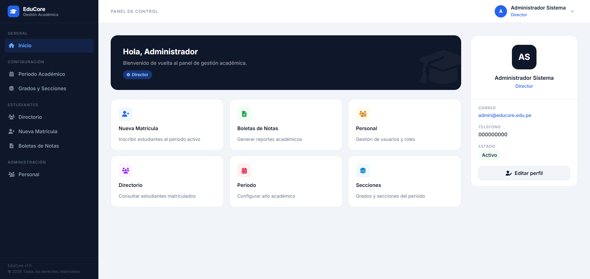
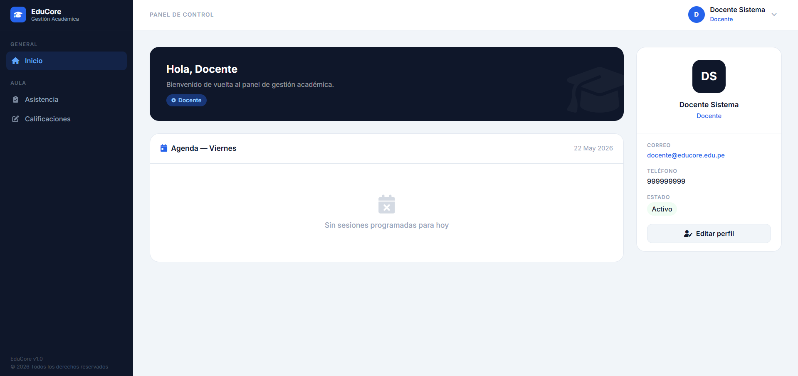

# EduCore — Sistema de Gestión Académica


Sistema web para la administración académica de instituciones educativas de nivel primaria y secundaria. Desarrollado en **PHP nativo** con **PostgreSQL** (Supabase) como base de datos en la nube.

---

## Contenido

- [¿Para qué sirve?](#-para-qué-sirve)
- [Roles del sistema](#-roles-del-sistema)
- [Tecnologías](#-tecnologías)
- [Requisitos previos](#-requisitos-previos)
- [Instalación](#-instalación)
- [Estructura del proyecto](#-estructura-del-proyecto)
- [Flujo de configuración inicial](#-flujo-de-configuración-inicial)
- [Capturas](#-capturas)

---

## Para qué sirve

EduCore centraliza los procesos administrativos y académicos de un colegio en una sola plataforma:

| Módulo                   | Descripción                                                                                         |
| ------------------------ | --------------------------------------------------------------------------------------------------- |
| **Gestión de personal**  | Registro de directores, secretarias y docentes con control de acceso por rol                        |
| **Matrículas**           | Inscripción de estudiantes nuevos y reingresantes, con validación de vacantes y situación académica |
| **Periodos y secciones** | Configuración del año lectivo, bimestres, grados y secciones                                        |
| **Asistencia**           | Registro diario por curso con historial editable                                                    |
| **Calificaciones**       | Ingreso de notas por competencia y bimestre                                                         |
| **Boletas de notas**     | Generación e impresión del informe de progreso del aprendizaje por alumno                           |

---

## Roles del sistema

| Rol            | Acceso                                              |
| -------------- | --------------------------------------------------- |
| **Director**   | Acceso completo a todos los módulos                 |
| **Secretaria** | Matrículas, directorio, boletas y personal          |
| **Docente**    | Asistencia y calificaciones de sus cursos asignados |

---

## Tecnologías

| Capa             | Tecnología                                           |
| ---------------- | ---------------------------------------------------- |
| Backend          | PHP 8+ (sin framework)                               |
| Base de datos    | PostgreSQL 17 vía [Supabase](https://supabase.com)   |
| Frontend         | HTML, CSS (design system propio), JavaScript vanilla |
| Servidor local   | XAMPP (Apache)                                       |
| Fuentes e íconos | Inter (Google Fonts), Font Awesome 6                 |

---

## Requisitos previos

- [XAMPP](https://www.apachefriends.org/) con PHP 8.0 o superior
- Extensión **`pdo_pgsql`** habilitada en `php.ini`
- Cuenta en [Supabase](https://supabase.com) (el plan gratuito es suficiente)
- Conexión a internet (la base de datos está en la nube)

### Habilitar pdo_pgsql en XAMPP

Abre `C:\xampp\php\php.ini`, busca la línea siguiente y quítale el punto y coma:

```ini
;extension=pdo_pgsql
```

Debe quedar así:

```ini
extension=pdo_pgsql
```

Luego reinicia Apache desde el panel de XAMPP.

> [!TIP]
> Si Apache no levanta tras el cambio, verifica que el archivo `php_pdo_pgsql.dll` exista en `C:\xampp\php\ext\`. Si no está, reinstala XAMPP o descarga la DLL compatible con tu versión de PHP.

---

## Instalación

### Opción A — Setup automático (recomendado)

Después de configurar las credenciales en `Config/database.php`, abre en el navegador:
http://localhost/EduCore/setup.php

El script ejecuta todos los pasos de una sola vez: crea las tablas, carga los grados, crea el usuario admin y te redirige al login.

> [!WARNING]
> Elimina `setup.php` del servidor una vez que termines la instalación. Dejarlo accesible es un riesgo de seguridad.

---

### Opción B — Instalación manual

#### 1. Clonar el repositorio

```bash
git clone https://github.com/tu-usuario/EduCore.git
```

Coloca la carpeta dentro de `C:\xampp\htdocs\`.

#### 2. Crear el proyecto en Supabase

1. Ve a [supabase.com](https://supabase.com) → **New project**
2. Anota el **host**, **usuario** y **contraseña** de la base de datos
3. En **Settings → Database → Connection parameters** encontrarás todos los datos de conexión

#### 3. Configurar la conexión

Edita `Config/database.php` y reemplaza los valores de ejemplo:

```php
private $host    = 'db.XXXXXXXXXX.supabase.co';  // tu host
private $usuario = 'postgres.XXXXXXXXXX';         // tu usuario
private $clave   = 'TU_PASSWORD';                 // tu contraseña
private $puerto  = '6543';                        // puerto del pooler
```

> [!NOTE]
> El puerto `6543` corresponde al **connection pooler** de Supabase (modo Transaction). Si tienes problemas de conexión, prueba con el puerto directo `5432` desde **Settings → Database → Connection parameters → Direct connection**.

#### 4. Crear las tablas

Copia el contenido de `supabase_migration.sql` y ejecútalo en **Supabase → SQL Editor → New query → Run**.

#### 5. Cargar los grados

Abre en el navegador:
http://localhost/EduCore/setup.php

Esto crea el `Admin y su contraseña` y carga los grados y demás

> [!WARNING]
> Elimina `setup.php` después de ejecutarlo.

Credenciales por defecto:
Usuario: admin
Contraseña: admin123

> [!IMPORTANT]
> Cambia la contraseña desde el perfil justo después del primer inicio de sesión.

#### 7. Ingresar al sistema

http://localhost/EduCore/Views/Auth/login.php

---

## Estructura del proyecto

```
EduCore/
├── Config/
│   ├── database.php               # Conexión PDO a Supabase (singleton)
│   └── session_check.php          # Validación de sesión activa
│
├── Controllers/                   # Lógica de negocio por módulo
├── Models/                        # Acceso a datos (PDO)
│
├── Views/                         # Vistas PHP por módulo
│   ├── Layout/                    # Header y sidebar compartidos
│   ├── Auth/                      # Login / logout
│   ├── Dashboard/                 # Inicio y perfil
│   ├── Administracion/            # Gestión de personal
│   ├── Gestion_Estudiantes/       # Matrículas y directorio
│   ├── Gestion_Institucional/     # Periodos, grados, secciones, cursos
│   ├── Asistencia/                # Registro e historial
│   ├── Notas/                     # Calificaciones
│   └── Boleta_Notas/              # Generación de boletas
│
└── supabase_migration.sql         # Script DDL para crear las tablas

```

---

## Flujo de configuración inicial

Sigue este orden la primera vez que configures el sistema. Saltarte pasos puede generar errores de integridad referencial.

```
Crear periodo académico   →  Periodo Académico
Verificar grados cargados →  Grados y Secciones
Registrar docentes        →  Personal
Crear secciones           →  Grados y Secciones → + Sección
Asignar docentes a cursos →  Carga Académica
Matricular estudiantes    →  Nueva Matrícula
Registrar asistencia      →  Asistencia        (rol Docente)
Ingresar calificaciones   →  Calificaciones    (rol Docente)
Generar boletas           →  Boletas de Notas
```

> [!TIP]
> Si al matricular un estudiante el sistema no muestra secciones disponibles, verifica que el paso 4 (crear secciones) se haya completado y que el periodo académico esté marcado como activo.

---

## Capturas

**Login**

> 

**Dashboard — Director y Secretaria**

Interfaz compartida entre el rol Director y Secretaria. Ambos tienen acceso al nivel administrativo del sistema.

> 

**Dashboard — Docente**

Vista simplificada orientada al registro de asistencia y calificaciones.

> 

---

## Licencia

Proyecto de portafolio personal. Uso educativo y de demostración.
